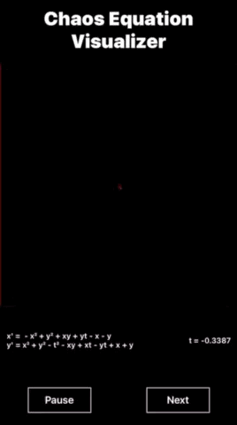

# Chaos Equation Visualizer



## Description

The Chaos Equation Visualizer is a mobile application that dynamically generates and visualizes chaos equations. It provides an interactive and visually engaging way to explore the fascinating world of chaos theory and dynamic systems.

## Features

- Real-time visualization of chaos equations
- Dynamic generation of new equations
- Pause and resume functionality
- Display of current equation and time value
- Sleek, dark-themed user interface

## Technology Stack

- React Native
- Expo
- WebGL (via Expo GLView)

## Installation

1. Clone the repository:
   ```
   git clone https://github.com/konstavenn/chaos-equation-visualizer.git
   ```

2. Navigate to the project directory:
   ```
   cd chaos-equation-visualizer
   ```

3. Install dependencies:
   ```
   npm install
   ```

4. Start the Expo development server:
   ```
   expo start
   ```

5. Use the Expo Go app on your mobile device to scan the QR code and run the application.

## Usage

- The main screen displays the chaos equation visualization.
- The current equation and time value are shown at the bottom of the screen.
- Use the "Pause" button to freeze the animation.
- Press "Next" to generate a new chaos equation.

## How It Works

The application uses a set of parametric equations to generate points in 2D space. These points are then rendered using WebGL, creating intricate patterns that evolve over time. The equations are of the form:

```
x' = f(x, y, t)
y' = g(x, y, t)
```

Where `f` and `g` are polynomial functions of `x`, `y`, and `t`, with randomly generated coefficients.

## Contributing

Contributions are welcome! Please feel free to submit a Pull Request.

## License

This project is licensed under the MIT License - see the [LICENSE.md](LICENSE.md) file for details.

## Acknowledgments

- Inspired by the work of chaos theorists and dynamic systems researchers.
- Built with React Native and Expo.

---

For more information or to report issues, please visit the [project repository](https://github.com/yourusername/chaos-equation-visualizer).